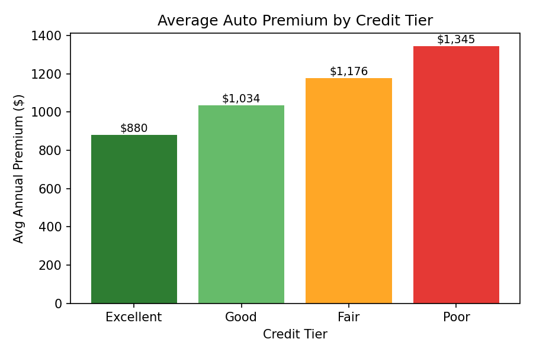

# Multi-Line Insurance Premium Analysis (SQL/SQLite)

Combined synthetic auto and home insurance policy data into a relational
SQLite database and analyzed premium trends across customer demographics
using SQL aggregates, `GROUP BY`, and `CASE WHEN` logic to identify key
drivers of premium variation.

## Overview

This project models a book of ~800 customers holding auto and/or home
insurance policies and investigates what actually drives premium pricing —
credit tier, claims history, age, geography, and loyalty/bundling — using
pure SQL analysis against a relational database.

## Data

Data is **synthetically generated** (`generate_data.py`) with realistic,
built-in relationships between risk factors and premiums, so the SQL
analysis surfaces genuine, interpretable patterns rather than noise.

**Schema (3 tables, `insurance.db`):**

| Table | Description |
|---|---|
| `customers` | customer_id, age, state, credit_tier, years_with_company, prior_claims_5yr, bundled_discount |
| `auto_policies` | policy_id, customer_id, vehicle_type, coverage_level, annual_premium |
| `home_policies` | policy_id, customer_id, home_type, coverage_level, annual_premium |

## Analysis

All analysis lives in [`analysis_queries.sql`](analysis_queries.sql) and covers:

1. Average auto premium by credit tier
2. Bundled vs. non-bundled combined premium comparison
3. Age-bracket segmentation (`CASE WHEN`)
4. Prior claims impact on premium, auto vs. home
5. State-level premium comparison flagged against the book average
6. Vehicle type × coverage level premium matrix
7. Customer tenure discount effect

### Key finding

Credit tier was the single strongest premium driver in this dataset:



Customers in the "Poor" credit tier pay **~53% more** on average than
"Excellent" tier customers for otherwise comparable coverage — more than
any other single factor tested (age, claims history, or geography).

## How to run it

```bash
pip install pandas numpy matplotlib
python generate_data.py      # creates customers.csv, auto_policies.csv, home_policies.csv
python build_database.py     # builds insurance.db
sqlite3 insurance.db < analysis_queries.sql   # or open in DB Browser for SQLite
```

## Tools used

SQL (SQLite), Python (pandas, numpy, matplotlib)
